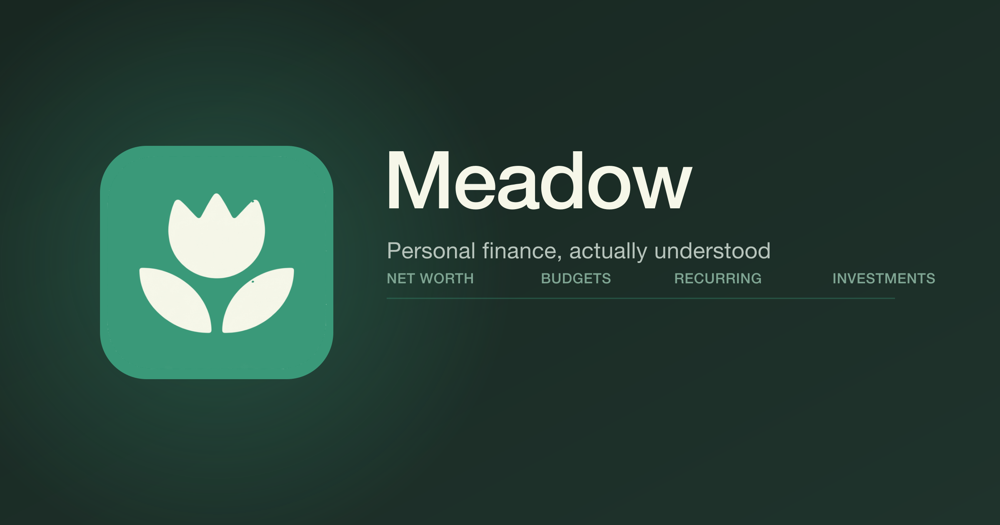

<p align="center">
  
</p>

<p align="center">
  <a href="https://github.com/shotuu/meadow/actions/workflows/ci.yml"></a>
  
  
  
</p>

Meadow is a personal finance app built to answer one question honestly: where
does the money actually go. It pulls in real transactions from linked banks
and brokerages, categorizes them automatically, and turns that into budgets,
net worth, and recurring-spend tracking that stay correct without manual
upkeep.

## Features

- **Net worth, in one place** — every linked account (checking, credit,
  brokerage, loans) rolled up by currency, with a history chart.
- **Automatic transaction sync** — [Plaid](https://plaid.com) for US/Canada/EU
  banks, [Finverse](https://finverse.com) for Singapore banks (OCBC, DBS), and
  IBKR Flex Query reports for brokerage holdings and trades.
- **Three budgeting modes on one engine** — monthly reset, rollover envelopes,
  and sinking funds for savings goals with a deadline, all built on the same
  pure budget-period math.
- **Categorization that learns** — rule-based matching (exact merchant /
  contains / regex) with an active-learning loop: correct a transaction's
  category once, and Meadow writes a rule so the same merchant is never
  miscategorized again. A Gemini-backed AI pass fills in what the rules miss.
- **Recurring charge detection** — subscriptions and recurring bills surface
  automatically from transaction history, no manual entry.
- **Spend by category, any time range** — today, 7/30 days, month-to-date,
  year-to-date.
- **CSV import** with column mapping and hash-based dedup, for anything not
  covered by a live sync.
- **A real PWA** — installable on iOS/Android with native-feeling bottom-tab
  navigation (Konsta UI) on mobile and a standard sidebar on desktop.

## Tech stack

| Layer | Choice |
|---|---|
| Framework | Next.js 16 (App Router, Server Actions, Turbopack) |
| Database | PostgreSQL via Prisma 7 |
| Auth | Auth.js (Google OAuth) |
| Background jobs | Standalone Node worker, `node-cron` |
| Bank data | Plaid, Finverse, IBKR Flex Query |
| AI categorization | Google Gemini |
| UI | shadcn/ui + Konsta UI, Tailwind v4 |
| Monorepo | pnpm workspaces |

## Architecture

A pnpm monorepo: `apps/web` (the Next.js app), `apps/worker` (nightly sync
and categorization jobs), `packages/db` (the Prisma schema and client,
shared by both), and `packages/finance-logic` (pure, framework-free budget
and recurring-detection math, unit-tested independently of the database).

Each bank/brokerage integration is its own package
(`packages/plaid-sync`, `packages/finverse-sync`, `packages/ibkr-sync`)
following the same shape: an encrypted-token connection record, an account
mapper, a sync function the worker calls nightly, and a manual "Sync now"
path the web app calls on demand.

Money is a signed `Decimal` (negative = money out). Transfers between the
user's own accounts are two linked, `isTransfer`-flagged rows rather than
one, so aggregate spend/income queries never double-count them.

## Getting started

Requires Node 22+, pnpm, and a Postgres instance.

```bash
pnpm install
cp .env.example .env   # fill in DATABASE_URL and the provider keys you need
pnpm db:migrate
pnpm db:seed           # optional: 3 starter category templates
pnpm dev                # web app
pnpm dev:worker         # background jobs, in a second terminal
```

```bash
pnpm test                                 # unit tests (finance-logic, sync packages)
pnpm --filter web exec tsc --noEmit       # typecheck
pnpm --filter web lint                    # eslint
pnpm build                                # production build
```

## License

MIT
